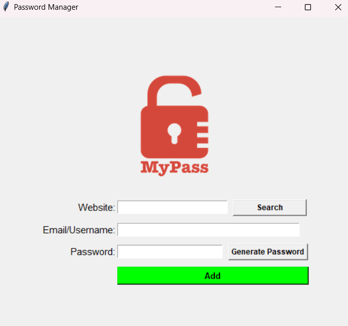

# Password-Manager

Description: A simple Password Manager built with Python and Tkinter. Securely store and manage your website credentials, generate strong passwords, and retrieve login details effortlessly.

# sample image

  

